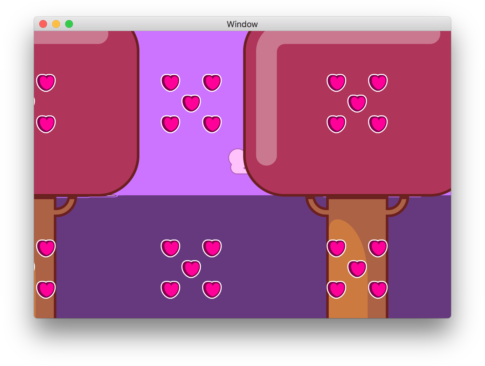
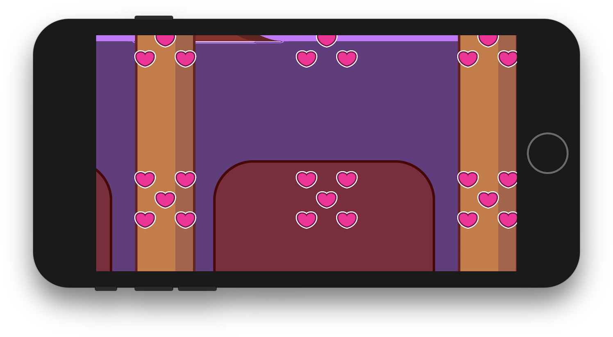

# DinnerJacket

OpenGL-based, ad hoc sprite library for my personal projects.

#### Some features include:
- Rendering solid and textured sprites in a tree hierarchy of nodes.
- Flipbook-style animation of sprites.
- Texture atlasing ("spritesheets")
- Tilemaps with multiple layers and parallax
- Basic performance optimizations
- Asynchronous loading of resources in the background, concurrent with animation and
rendering of available resources.
- Support for both **iOS** (OpenGL ES) and **macOS** (OpenGL).

### Project Status
The project is currently **abandoned**. This repository is made public for demonstration
purposes and for reference. I am using it as a test bed for development tools such as Travis CI, etc.

### Related Projects
I am now working on a fully redesigned sprite library
and game editor based around the new Metal API, coded entirely in Swift.

### Screenshots

